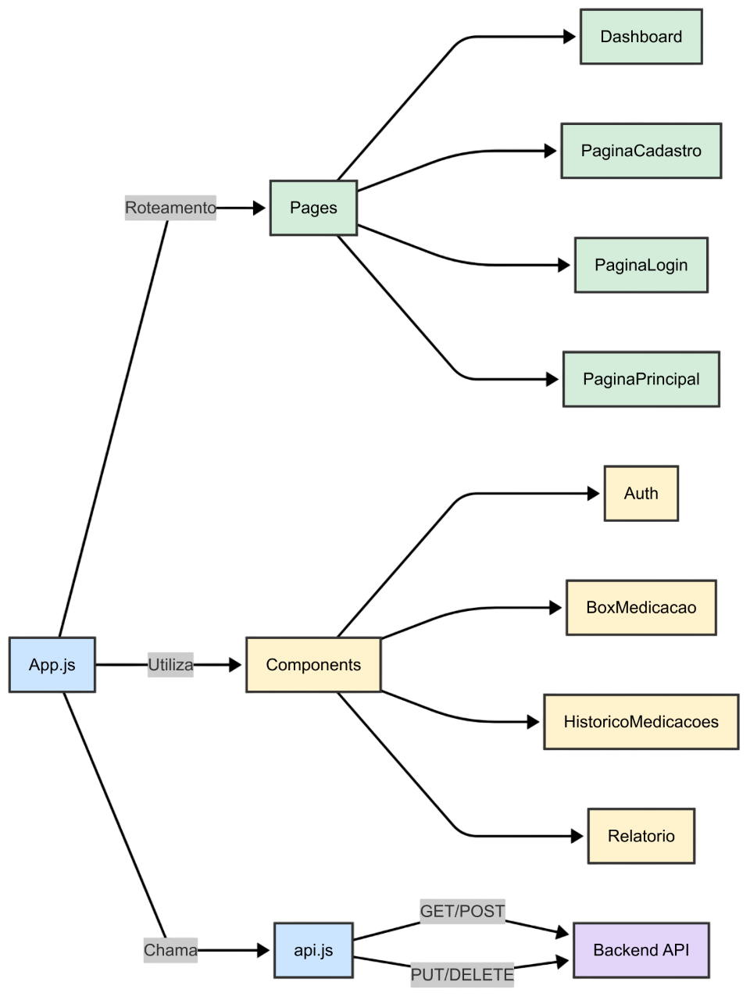
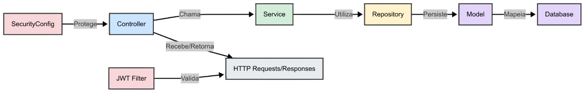
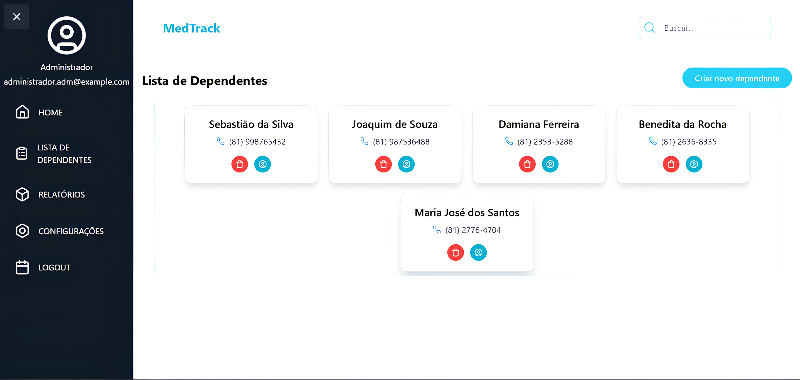
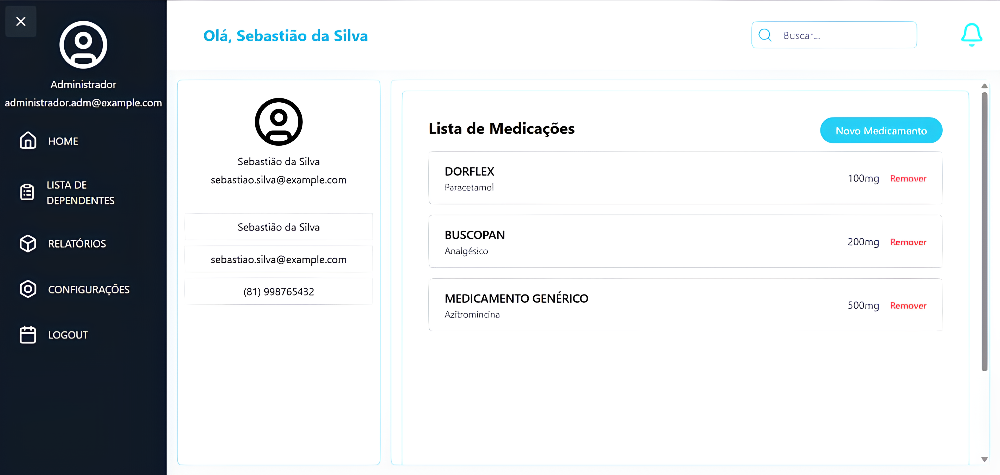
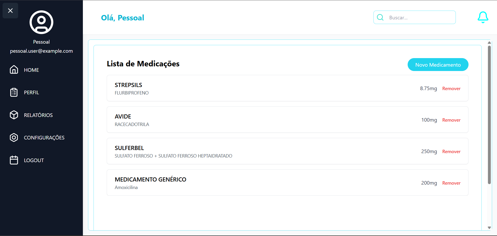
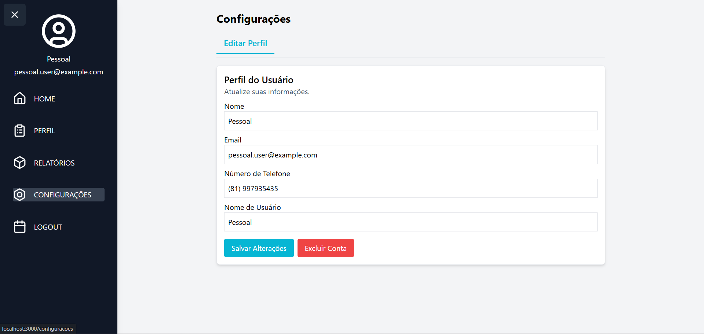
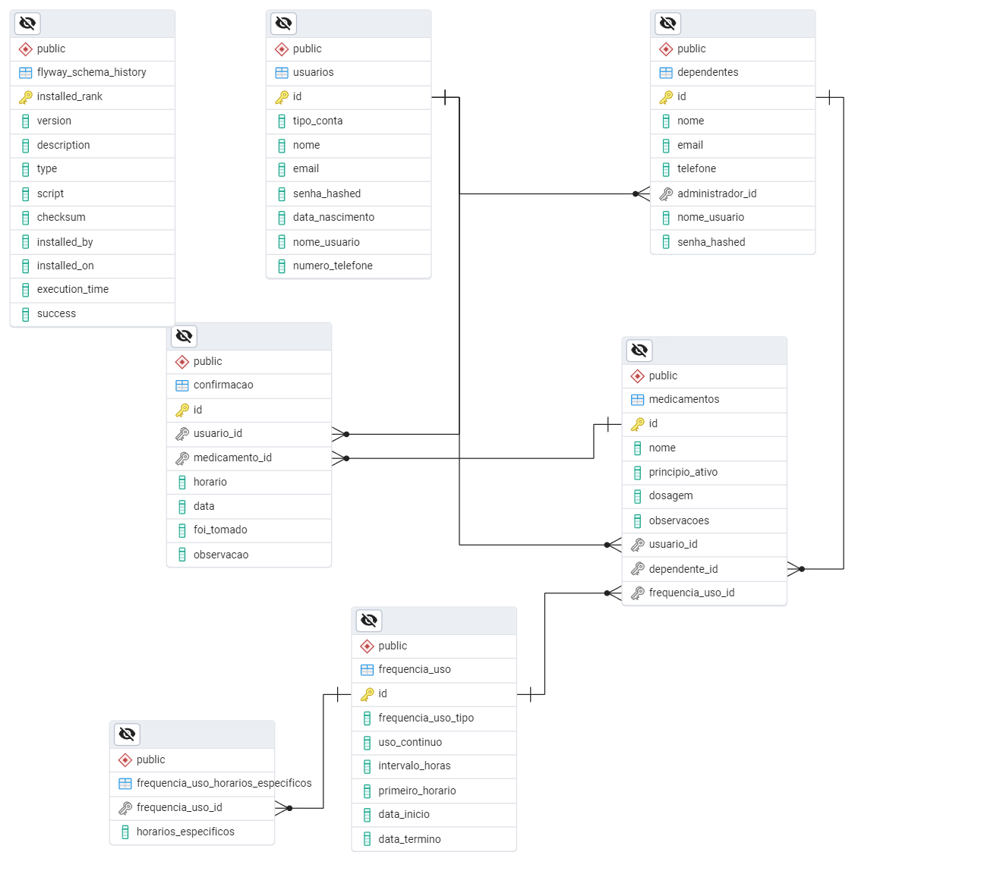
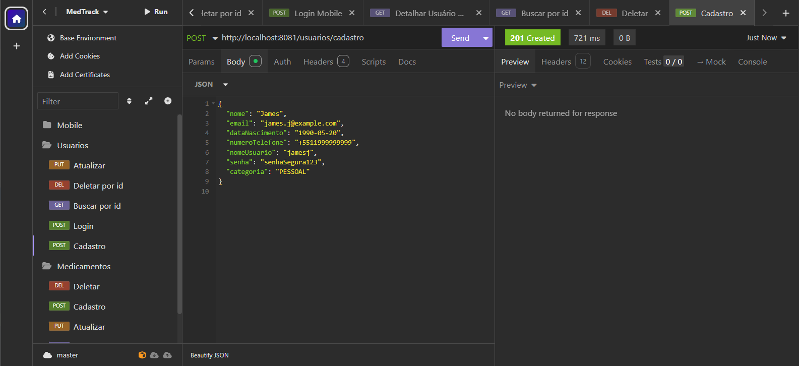
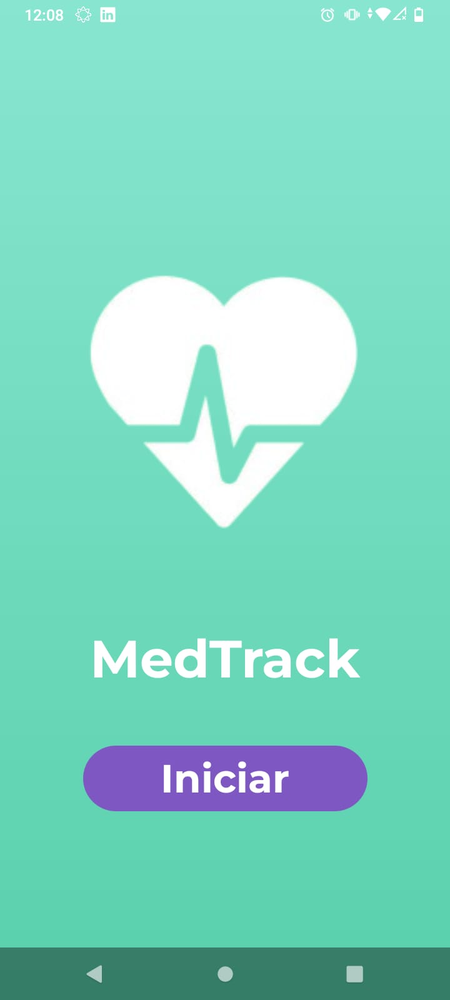

# MedTrack Web: Dashboard & API 🌐

<div align="center">
    
</div>

> Plataforma web completa para gerenciamento de medicação com dashboard adaptável e API robusta

## Visão Geral

<div align="center">
  
</div>

O **MedTrack Web** é uma plataforma completa desenvolvida para:
- 👨‍⚕️ **Administradores** gerenciarem pacientes e medicamentos
- 👤 **Usuários** controlarem sua própria medicação
- 📊 Geração de relatórios e histórico completo

**Funcionalidades-chave:**
- 🔐 Autenticação JWT com roles (ADMINISTRADOR/USUÁRIO)
- 📱 Sincronização em tempo real com o app mobile
- 📅 CRUD completo de medicamentos e usuários
- 📈 Dashboard analítico com gráficos

## ✨ Destaques Técnicos

### 🏗️ Arquitetura do Projeto

#### Frontend (React)
- **React** com JavaScript
- **Tailwind CSS** para estilização

<div align="center">
  
</div>

#### Backend (Spring Boot)
- **Java 21** com **Spring Boot 3**
- Arquitetura RESTful
- Spring Security + JWT
- Spring Data JPA + Flyway
- PostgreSQL como banco de dados

<div align="center">
  
</div>

### 📊 Dashboard Interativo

> 👨‍⚕️ **Visão Administrador**
- Gerenciamento de todos os usuários
- Relatórios completos de adesão à medicação
- CRUD de medicamentos para qualquer usuário

<div align="center">
  
  
</div>

> 👤 **Visão Usuário**
- Controle pessoal de medicamentos
- Histórico de confirmações
- Adição/remoção de medicamentos

<div align="center">
  
  
</div>

### 🔐 Sistema de Autenticação
- JWT (JSON Web Tokens)
- Roles (ADMINISTRADOR/USUÁRIO)
- Proteção de rotas no frontend e backend


```java
@Configuration
public class SecurityConfig {

    @Bean
    public PasswordEncoder passwordEncoder() { return new BCryptPasswordEncoder(); }

    @Bean
    public AuthenticationManager authenticationManager(AuthenticationConfiguration authenticationConfiguration) throws Exception {
        return authenticationConfiguration.getAuthenticationManager();
    }

    @Bean
    public SecurityFilterChain securityFilterChain(
            HttpSecurity http,
            JwtService jwtService,
            UsuarioDetailsService usuarioDetailsService
    ) throws Exception {
        JwtAuthenticationFilter jwtAuthenticationFilter = new JwtAuthenticationFilter(jwtService, usuarioDetailsService);

        http
                .cors(Customizer.withDefaults())
                .csrf(AbstractHttpConfigurer::disable)
                .authorizeHttpRequests(auth -> auth
                        .requestMatchers(HttpMethod.OPTIONS, "/**").permitAll()
                        .requestMatchers("/auth/**").permitAll()
                        .requestMatchers("/usuarios/admin/**").hasRole("ADMINISTRADOR")
                        .requestMatchers("/usuarios/user/**").hasRole("PESSOAL")
                        .requestMatchers("/usuarios/**").permitAll()
                        .anyRequest().authenticated()
                )
                .sessionManagement(session -> session.sessionCreationPolicy(SessionCreationPolicy.STATELESS))
                .addFilterBefore(jwtAuthenticationFilter, UsernamePasswordAuthenticationFilter.class);
        return http.build();
    }
}
```

### 🗃️ Banco de Dados
- Modelo relacional com PostgreSQL:
  - Migrações controladas com Flyway 
  - Relações entre usuários, medicamentos, dependentes, frequencia de uso e confirmações

<div align="center"> 
     
</div>

### 🌐 API Endpoints

Documentação completa dos endpoints REST disponível em dois formatos:

1. **[README das Rotas](src/README.md)** - Lista detalhada de todos os endpoints com:
  - Métodos HTTP
  - Parâmetros esperados
  - Exemplos de request/response
  - Status codes possíveis

2. **[Coleção do Insomnia](src/main/java/com/medtrack/medtrack/docs/insomnia)** - Arquivo pronto para importar no Insomnia contendo:
  - Todas as rotas configuradas
  - Exemplos de requests pré-prontos
  - Environment configurado
  - Autenticação JWT já implementada

> 💡 Dica: Importe a coleção no Insomnia para testar rapidamente todas as rotas com exemplos pré-configurados!

<div align="center">

  [](https://insomnia.rest/run/?uri=file://src/main/java/com/medtrack/medtrack/docs/insomnia/V3_Insominia_doc.json)
</div>

<div align="center"> 
     
</div>

### 🚀 Como Executar

##### **Pré-requisitos**
   - Node.js 18+ (Frontend)
   - Java 21+ JDK (Backend)
   - PostgreSQL 15+

#### **Frontend**
````bash
cd interface-react
npm install
npm start
````

#### **Backend**
`````properties
spring.datasource.url=jdbc:postgresql://${DB_HOST}/medtrack
spring.datasource.username=${DB_USER}
spring.datasource.password=${DB_PASSWORD}
`````

## 📱 MedTrack: Mobile

<div align="center">
  <a href="https://github.com/MClaraFerreira5/MedTrack-Mobile" target="_blank">
    
  </a>
</div>

### Aplicativo Complementar
O **MedTrack Mobile** é o aplicativo Android que se integra perfeitamente com a plataforma web:

- 📸 Captura de medicamentos via OCR
- 🔔 Notificações inteligentes
- ✅ Confirmação de medicamentos que sincroniza com o dashboard web

<div align="center"> 
   
</div>

### Integração Mobile-Web
- 🔄 Sincronização em tempo real dos dados de medicação
- 🔐 Autenticação unificada JWT
- 📩 Notificações complementares via email

## 🌟 Time de Contribuidores

<div align="center">

<table>
  <tr>
    <td align="center">
        <br />
        <sub><b>Maria Clara</b></sub>
      <br />
      <a href="https://github.com/MClaraFerreira5">
        
      </a>
      <a href="https://www.linkedin.com/in/clara-ferreira-dev/">
        
      </a>
      <br />
      <code>Frontend & Mobile</code>
    </td>
    <td align="center">
        <br />
        <sub><b>Ellen Rocha</b></sub>
      <br />
      <a href="https://github.com/EllenRocha1">
        
      </a>
      <a href="https://www.linkedin.com/in/ellen-rocha-dev/">
        
      </a>
      <br />
      <code>Backend & Frontend</code>
    </td>
    <td align="center">
        <br />
        <sub><b>Yann Leão</b></sub>
      <br />
      <a href="https://github.com/YannLeao">
        
      </a>
      <a href="https://www.linkedin.com/in/yannleao-dev">
        
      </a>
      <br />
      <code>Backend & Mobile</code>
    </td>
  </tr>
</table>

</div>

## 📄 Licença

Projeto acadêmico desenvolvido para a disciplina de **Projeto Interdisciplinar de Engenharia da Computação 1 (PIEC1)**  
Universidade Federal Rural de Pernambuco — Unidade Acadêmica de Belo Jardim (UFRPE/UABJ)


